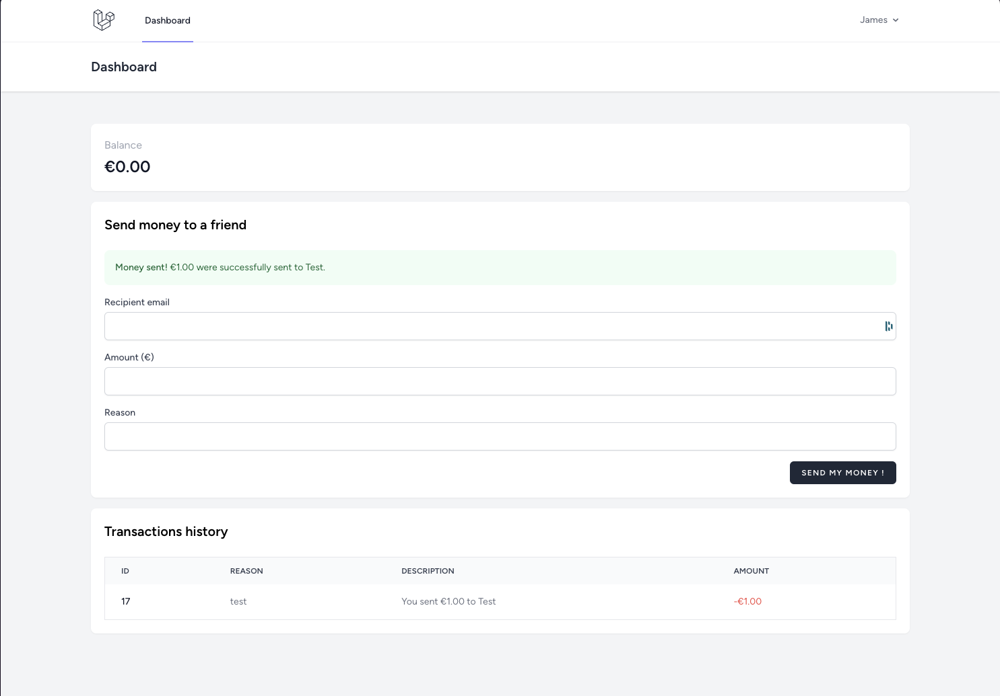

# Test Technique - Laravel Wallet



## Requirements

- PHP 8.2+
- Composer

(i) No need database, just use sqlite.

## Installation

```bash
composer install
```

```bash
php artisan key:generate
```

```bash
php artisan migrate:fresh --seed
```

```bash
npm install
```

```bash
npm run dev
```

```bash
php artisan serve
```

## Running tests

```bash
vendor/bin/pest
```

## Running formatter

```bash
vendor/bin/pint
```

## Default Users

Rich chill guy (1M€ balance):
- Email: rich.chill.guy@test.fr
- Password: password

Another guy (0€ balance):
- Email: another.guy@test.fr
- Password: password

## Database schema


Amounts are saved in cents.

Some Laravel tables are included : 
- sessions
- cache
- cache_locks
- jobs
- job_batches
- failed_jobs

## Tickets

### Bugfix - Error on login

On first login after registering, this error is thrown:
```
Call to a member function transactions() on null
```

You need to write a test to ensure that this error does not occur again.

### Feature - Notification when balance is low

When a user balance is low (< 10€), he should be notified by email.

You must write a test for this feature.

### Feature - Recurring transfers

As a user, I want to be able to create recurring transfers.

I want to define : 
- A start date
- An end date
- A frequency in days
- An amount
- A reason

Of course, I want to be able to delete a recurring transfer.

The transfer must be executed every X days (according to the periodicity defined by the user) at 2:00 a.m.
The transfer must also be executed immediately after its creation.

If the user has a balance lower than the amount, the transfer should fail and the user should be notified by email.

This feature must be available in the API and the front-end.

You must write tests for this features.

Don't forget to write seeders & factories.

### BONUS - Feature - Sync wallet balance

You need to write an action that reconstitutes the balance of a portfolio from its transaction history.

You must write tests for this action.
